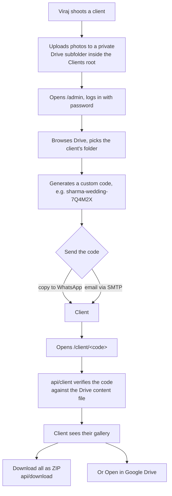

# Client Photo Delivery — Plan of Action

**Goal:** let Viraj deliver each client's finished photos **from his own website**. He
uploads a shoot to a private Google Drive folder, picks that folder in an admin
screen, and generates a **custom access code / link**. Only that client can use the
code to view and download their photos.

**Status:** not built in the current site. It *was* built previously and removed;
the complete version is recoverable from git commit **`761ec6e`** (branch
`bacckend`). This document is the plan to bring it back and wire it into the
current codebase.

---

## 1. Approaches considered

| # | Approach | Effort | Monthly cost | Security | Who maintains it |
|---|----------|--------|--------------|----------|------------------|
| **A** | **Custom Drive + code (chosen)** | High (restore + rewire) | £0 (storage only) | You own it — service-account sharing + codes | You |
| **B** | Gallery service (Pixieset / Pic-Time / CloudSpot) | Low (~1 hr) | Free tier → ~$8–40 | Handled by vendor | Vendor |
| **C** | Lightweight code → unlisted link | Low (~2–3 hrs) | £0 | "Unguessable link" only | You (manual per client) |

### Why **A** (the client's choice)
- Photos live in **Viraj's own Google Drive** — familiar, free, no third-party lock-in.
- Delivery happens **on his own domain** — fully branded, no "powered by Pixieset".
- No per-gallery or per-GB fee.

### The honest cost of choosing A
- Reintroduces a **backend** (Vercel serverless functions) — the site stops being
  purely static.
- **You own the security and maintenance.** It is solid, but it is real code, not a
  vendor's problem.
- Needs a **one-time Google Cloud setup** (service account) that only Viraj can do.

> If the Google Cloud setup is a blocker, **Option B (Pixieset)** delivers the same
> outcome for the client with zero backend — keep it in your back pocket.

---

## 2. How the chosen system works

**Key idea:** the private folders are shared **only with the service account**, never
"anyone with the link". The website's backend is the *only* thing that can read them,
and it only does so after checking the client's code. A stranger hitting `/client`
with a wrong code gets nothing.

---

## 3. What gets restored (code side)

From commit `761ec6e`:

### Backend — `api/` (Vercel serverless functions)
| File | Purpose |
|------|---------|
| `api/_lib/drive.js` | Google Drive client (service-account auth) |
| `api/_lib/auth.js` | Admin session cookie sign/verify |
| `api/_lib/delivery.js` | Turns a code → the client's folder + files |
| `api/_lib/mail.js` | SMTP sender |
| `api/_lib/ratelimit.js` | Basic abuse protection on code guessing |
| `api/auth.js` | `POST` login / `GET` am-I-authed |
| `api/library.js` | Browse Drive folders/photos, create folders (admin) |
| `api/content.js` | Read/write the client list (stored as `content.json` in Drive) |
| `api/share.js` | Grant/revoke the service account's access to a folder |
| `api/client.js` | `GET /api/client?code=…` → that client's gallery |
| `api/download.js` | `GET /api/download?code=…` → streams a ZIP of the photos |
| `api/mail.js` | `POST` email a client their code |
| `api/thumb.js` | Proxies Drive thumbnails (so nothing is public) |

### Frontend
- `src/pages/Admin.jsx` — the admin dashboard (login, Drive picker, code generator, send).
- `src/pages/Client.jsx` — the `/client/<code>` download page.
- Admin/client **CSS block** (re-added to `src/data.js`).
- Routes `/admin`, `/client`, `/client/:code` (re-added to `src/App.jsx`).

### Config
- `package.json` deps: `googleapis`, `archiver` (ZIP), `nodemailer` (email).
- `vercel.json`: function config (e.g. `api/download.js` gets `maxDuration: 60`).
- `.env.example`: the variables in §6.

---

## 4. Implementation plan (phased)

**Phase 0 — Prerequisites (Viraj, ~20 min).** Service account + Drive folder + env
values. See §5. *Nothing else can be tested until this exists.*

**Phase 1 — Restore the backend.** Bring back `api/` from git, re-add the three deps,
re-add `vercel.json` function config. Verify each endpoint compiles and boots under
`vercel dev`.

**Phase 2 — Restore the frontend.** Bring back `Admin.jsx` + `Client.jsx`, re-add
their CSS to `data.js`, re-add the routes to `App.jsx`. Reconcile with everything
that changed since removal (contact modal, context shape, data layer).

**Phase 3 — Wire the client list.** Create the Drive `content.json` (holds the
code → folder map), point `DRIVE_CONTENT_FILE_ID` at it.

**Phase 4 — End-to-end test.** (See §8.) Create a test client folder, generate a
code, open `/client/<code>` in a private window, download the ZIP.

**Phase 5 — Deploy.** Add all env vars to Vercel, deploy, re-test on production, hand
Viraj a one-page "how to deliver a shoot" guide.

**Rough effort:** ~1 focused day of dev (Phases 1–4) once Phase 0 exists.

---

## 5. Prerequisites — what Viraj sets up (one time)

### 5.1 Google Cloud service account (free)
1. Go to <https://console.cloud.google.com> → create a project (e.g. "cc-delivery").
2. **APIs & Services → Library →** enable **Google Drive API**.
3. **APIs & Services → Credentials → Create credentials → Service account.** Name it,
   create, no roles needed.
4. Open the service account → **Keys → Add key → Create new key → JSON.** A `.json`
   file downloads. **This is `GOOGLE_SERVICE_ACCOUNT_JSON`** (paste the whole file on
   one line, or base64-encode it).
5. Note the service account's **email** (looks like
   `cc-delivery@cc-delivery.iam.gserviceaccount.com`).

### 5.2 Drive folder structure
1. In Viraj's Drive, make a folder named **`Clients`** (the delivery root).
2. **Share it with the service account email as _Editor_.** (Editor, not Viewer —
   creating per-client folders needs write access; children inherit it.)
3. ⚠️ **Never** set this folder to "Anyone with the link." Link-sharing is inherited,
   so every client folder would become public. Share by name only.
4. Create an empty file named **`content.json`** inside it, share it with the service
   account as **Editor** — this is `DRIVE_CONTENT_FILE_ID` (a service account has no
   storage of its own, so it can update a file Viraj owns but can't create one).

### 5.3 Optional — emailing codes (SMTP)
Any provider: Gmail (use an **App Password**, not the login password), SendGrid,
Mailgun, etc. Skip this and codes are copy-paste (WhatsApp) instead.

---

## 6. Environment variables

| Variable | Required | What it is |
|----------|----------|-----------|
| `GOOGLE_SERVICE_ACCOUNT_JSON` | ✅ | The service-account key JSON (raw or base64) |
| `DRIVE_ROOT_FOLDER_ID` | ✅ | ID of the `Clients` root folder (from its URL) |
| `DRIVE_CONTENT_FILE_ID` | ✅ | ID of the `content.json` file |
| `ADMIN_PASSWORD` | ✅ | Password for `/admin` — make it long |
| `ADMIN_SESSION_SECRET` | ✅ | Random string signing the admin cookie (`node -e "console.log(crypto.randomUUID())"`) |
| `DOWNLOAD_MAX_FILES` | ⬜ | ZIP cap (default 400). Above it → "Open in Drive" only |
| `DOWNLOAD_MAX_MB` | ⬜ | ZIP cap (default 1500 MB) |
| `SMTP_HOST` / `SMTP_PORT` / `SMTP_USER` / `SMTP_PASS` / `SMTP_FROM` | ⬜ | Only if emailing codes |
| `VERCEL_DEPLOY_HOOK_URL` | ⬜ | Unrelated to delivery (photo-sync rebuilds) |

All of these go in **local `.env`** *and* **Vercel → Settings → Environment Variables**.
`.env` is git-ignored — the key never enters the repo.

---

## 7. Security model

- **Private by default:** client folders are shared only with the service account.
  The site is the sole reader, and only after a valid code.
- **Codes:** long, unguessable, per-client (e.g. `sharma-wedding-7Q4M2X`). Revoking =
  removing the entry from `content.json`.
- **Rate limiting:** `api/_lib/ratelimit.js` throttles code-guessing.
- **Admin:** gated by `ADMIN_PASSWORD` + a signed session cookie; `/admin` is not in
  the public nav.
- **Downloads:** capped (`DOWNLOAD_MAX_*`); oversized shoots fall back to "Open in
  Drive," which Viraj shares to that client directly.
- **No public thumbnails:** even preview images proxy through `api/thumb.js`.

### Residual risks (accept or mitigate)
- Anyone with a **live code** can download that gallery (by design — that *is* the
  delivery mechanism). Rotate/expire codes if a client forwards theirs.
- The **service-account key is powerful** — it can read everything shared with it.
  Store it only in env vars; never commit it; rotate if leaked.
- The custom backend is **your** attack surface to keep patched.

---

## 8. Testing & verification

1. `vercel dev` locally with all env vars set.
2. In `/admin`: log in → browse Drive → create a folder "Test Client" → drop 3–4
   photos in it (via Drive) → generate a code.
3. Open `/client/<code>` in a **private/incognito** window (proves it works without
   Viraj's Google login): gallery loads, thumbnails render.
4. Click **Download** → ZIP downloads and opens with the right photos.
5. Try a **wrong code** → clean "not found," no data leak.
6. Deploy to Vercel, repeat 2–5 on the live URL.

---

## 9. Rollback

Everything is additive and isolated to `api/`, two pages, a CSS block, three deps,
and some routes. If it misbehaves: remove the `/admin` + `/client` routes (feature
goes dark instantly, public site unaffected), or revert the restore commit. The
public portfolio has zero dependency on any of it.

---

## 10. Decision checklist

- [ ] Viraj can create a Google Cloud service account (§5.1). **If no → use Pixieset.**
- [ ] Comfortable owning a small backend + its security (§7).
- [ ] OK with the site no longer being 100% static.
- [ ] Print sales / client favouriting / watermarking **not** needed (those are where a
      gallery service pulls ahead).

If all four are ✅ → proceed with restore (Phases 1–5).
If any is ❌ → reconsider Pixieset/Pic-Time (Option B).

---

## Appendix — Option B (Pixieset) in one paragraph

Sign up (free up to ~3 GB), upload each shoot as a gallery, set a password or email
access, share the link. Add a **"Client Galleries"** button on this site that points
to Viraj's Pixieset (custom-domain + branding available on paid tiers, so it still
feels in-house). Client gets downloads, favouriting, and optional print-sales — all
handled, nothing to maintain. Build on our side: ~1 hour (one button + a short page).
This is the lower-effort, lower-risk route to the same client outcome.
